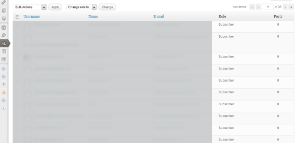
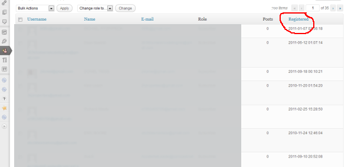

Recently I had a customer file a dispute with PayPal stating that they never received their product. If you sell products online, you have probably seen this type of person. Instead of just simply asking for a refund they have to be all dramatic about it.

The membership script I use (<a href="http://bit.ly/333Kxo2" target="_blank" rel="noopener noreferrer">DAP</a>) [aff link] instantly adds them into the script&#8217;s database, but they don&#8217;t get added into the WordPress database until they login for the first time. I quickly checked my WordPress Users list and she was listed so I knew she had logged in to the members area.

I needed a date though, so I had to log into my cpanel, open php-my-admin and then check the date she registered&#8230; what a pain. I decided I needed to add the registered date right into the Users page in WordPress.



A search online found quite a few solutions to add a registered date column. Most of them however required hacking core files of WordPress, which you should never do!

There were a few other solutions I found, **none of which worked** at all.
I finally found a support thread on the WordPress.org forums **with the solution that works** in 3.2+.

> **NOTE: I tested this on 10/30/2019 and it works in 5.2.4 (Current Version as of this update).**

~~<a href="http://wordpress.org/support/topic/show-registration-date-in-user-list-sortable" target="_blank" rel="noopener noreferrer">http://wordpress.org/support/topic/show-registration-date-in-user-list-sortable</a>~~

~~The second post by Ipstenu gives a link to the working code on pastebin as a plugin.~~ 

Here is the code since the pastebin is no longer available.

<div class="filename">show-registration-date.php</div>

```php
<?php

/*
Plugin Name: Show Registration Date
Description: Show registration date
Version: 0.1
Author: Ipstenu
Author URI: http://www.ipstenu.org/

        This plugin is free software; you can redistribute it and/or modify
        it under the terms of the GNU General Public License as published by
        the Free Software Foundation; either version 2 of the License, or
        (at your option) any later version.

        This plugin is distributed in the hope that it will be useful,
        but WITHOUT ANY WARRANTY; without even the implied warranty of
        MERCHANTABILITY or FITNESS FOR A PARTICULAR PURPOSE. See the
        GNU General Public License for more details.

*/

// Register the column - Registered
function registerdate($columns) {
    $columns['registerdate'] = __('Registered', 'registerdate');
    return $columns;
}
add_filter('manage_users_columns', 'registerdate');

// Display the column content
function registerdate_columns( $value, $column_name, $user_id ) {
        if ( 'registerdate' != $column_name )
           return $value;
        $user = get_userdata( $user_id );
        $registerdate = $user->user_registered;
        //$registerdate = date("Y-m-d", strtotime($registerdate));
        return $registerdate;
}
add_action('manage_users_custom_column',  'registerdate_columns', 10, 3);

function registerdate_column_sortable($columns) {
          $custom = array(
      // meta column id => sortby value used in query
          'registerdate'    => 'registered',
          );
      return wp_parse_args($custom, $columns);
}

add_filter( 'manage_users_sortable_columns', 'registerdate_column_sortable' );

function registerdate_column_orderby( $vars ) {
        if ( isset( $vars['orderby'] ) && 'registerdate' == $vars['orderby'] ) {
                $vars = array_merge( $vars, array(
                        'meta_key' => 'registerdate',
                        'orderby' => 'meta_value'
                ) );
        }

        return $vars;
}

add_filter( 'request', 'registerdate_column_orderby' );
?>
```

<hr />

Copy the code and paste it into Vs Code, Sublime, Notepad or a similar editor then save it as:<br /> <em>show-registration-date.php</em>

Use an ftp program to upload the php file right into your wp-content/plugins folder
or
Zip the file and install it as a plugin using the WP plugin installer. Activate the plugin.
**That's it! **

When you go to Users panel in your WP admin you should now see the sortable Registered date column.




I hope this helps narrow your search for a working solution to adding the Registered Date column into your Users panel.