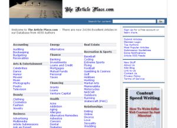

Back around 2007 when article writing and bum marketing were exploding I created an article directory.

A well know *marketing guru* asked us on his list if we knew of any smaller article directories to submit articles to.

I replied with a link to mine. A couple days later he emailed all of us on his list the links to about 10 small directories, including mine.

My site exploded in just a couple of months. I had over 4000 authors and 24,000+ articles. I was earning some money through adsense and an ebook offer. I was ecstatic!

One day I opened up my site to approve any new articles/authors and found the dreaded _*error establishing a database connection*_. I never paid attention to the warnings I had gotten about [backing up my website](http://bit.ly/2WhRNd7). I mean the web host makes backups - right?

Well they do, of the HTML and CSS files but <strong>NOT databases</strong>. I contacted the webhost looking for assistance. I was told there was nothing they could do.

I was devastated. 24,000+ articles, my list of 4,000+ authors and an income stream was all gone overnight!
<strong>Backing up your sites is so easy today. Especially if you are using WordPress.</strong>

Do yourself a favor and backup your site. If you are using WordPress grab your copy of the [Backup Creator](http://bit.ly/2WhRNd7)) plugin.

I would hate to see your site disappear into oblivion like mine did.