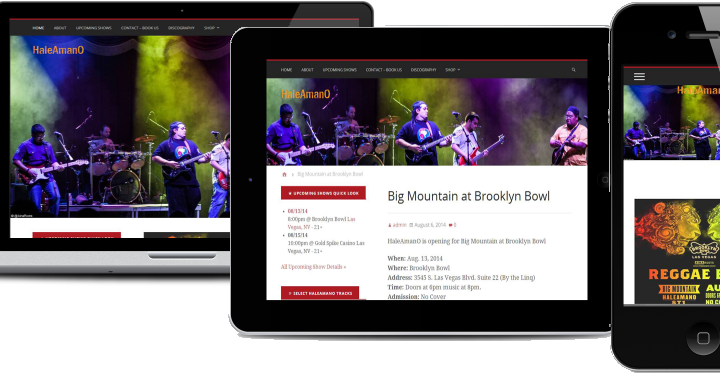

##Web Design

Website design has come a long, long way since the late 90’s hasn’t it? Think back to the dates of Geocities and all of those sparkling self-made graphics and animated gifs everywhere on the web.  It’s sort of like a pop culture fad, only the kind that will NEVER come back into fashion.

Once we all got HTML under our belts CSS came along and cranked the challenge meter up a notch.  Today’s web design (if done well) is streamlined, aesthetically pleasing, and sexy.

##Responsive web design

Enter the age of mobile. All of those sexy streamlined websites may be left in the dust with their sales even dustier, if they are not sporting responsive web design.  What does responsive mean? It simply means that the website is coded to conform to the screen on whatever mobile device it’s viewed on.   All of your text, menus, images and such are packaged up in a neat size appropriate column that helps your user navigate to the information that they need.

Responsive doesn’t instantly mean “good” though.  Some platforms and themes just don’t do it well, and you’re left with a muddled up list of links and buttons that don’t line up or don’t make sense.  Beware also, of plugins that promise to turn your desktop site mobile friendly, but really it’ll wind up looking like you tried to stuff a marshmallow into a parking meter. It’ll be a jumbled up, misaligned, disconnected mess.

There are more reasons than just aesthetics though, to be sporting a responsive website.  People searching on mobile are not necessarily just millennials with a technology habit. People searching on mobile expect a responsive site design that provides them relevant information, in the time frame in which they need it, which is usually, NOW! More people now shop from mobile phone and tablet than ever before.  We are creatures of instantaneous satisfaction, convenience and comfort.  What’s more convenient and comfortable than buying a new pair of shoes form the comfort of your couch in your jammies, or booking an appointment for the dentist while you ride the train or bus home from work?

If you’ve ever placed a Facebook Ad, you’ll notice that you can serve up your content to desktop users, mobile users, or both.  Responsive web design is like social media folks, it’s here, it’s not a fad, and it’s not going anywhere. In fact, <strong>on  April 21, 2015 Google is going to start looking at responsive web design and mobile friendliness as a factor in search rankings.</strong>

You’ve heard the old saying “You can please all of the people some of the time and some of the people all of the time but you can never please all of the people all of the time”? With responsive web design, this is simply no longer true.  By making your site responsive, you are in fact, making all of your visitors happy, all of the time whether they are on their mobile phone, tablet, laptop or desktop.  Isn’t that where you want to be?

[Contact](http://www.pegasusteam.com/#contact/) PegasusTeam today to find out how your site performs on mobile. You have nothing to lose, but traffic.